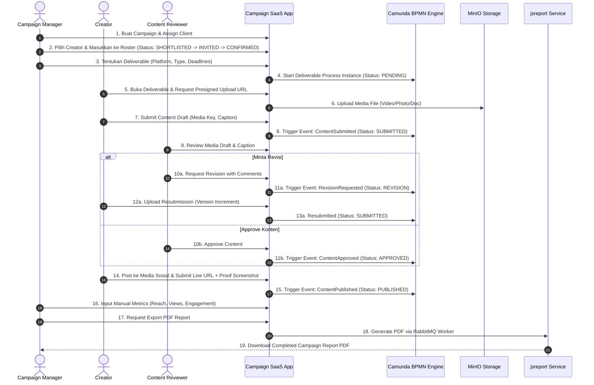

# User Flows & Workflow Diagrams — Campaign SaaS

## 1. Document Control
- **Title**: User Flows & Interaction Specification
- **Purpose**: Memetakan seluruh alur pengguna interaktif dari inisiasi campaign hingga final reporting.
- **Status**: ACCEPTED
- **Scope**: Core MVP Flows

---

## 2. End-to-End Campaign Lifecycle Flow



---

## 3. Detail Sub-Flows

### 3.1 Flow Creator Assignment & Status Transition
```text
[SHORTLISTED] ──(Kirim Undangan)──> [INVITED]
   │                                   │
   └───(Ditolak Agensi/KOL)──────┐    ├──(KOL Menolak)──> [REJECTED]
                                 │    └──(KOL Setuju)───> [ACCEPTED]
                                 │                           │
                                 │                (Diskusi Rate/Fee)
                                 │                           │
                                 │                           ▼
                                 │                     [NEGOTIATION]
                                 │                           │
                                 │                    (Kesepakatan)
                                 │                           │
                                 │                           ▼
                                 │                     [CONFIRMED]
                                 │                           │
                                 │                    (Campaign Selesai)
                                 │                           │
                                 ▼                           ▼
                            [CANCELLED]                [COMPLETED]
```

### 3.2 Flow Deliverable & Content Approval
```text
[PENDING] ──(Creator Upload Draft)──> [SUBMITTED]
                                           │
                                    (Reviewer Evaluasi)
                                           │
                    ┌──────────────────────┴──────────────────────┐
                    │                                             │
             (Butuh Perbaikan)                                (Sesuai)
                    │                                             │
                    ▼                                             ▼
               [REVISION]                                     [APPROVED]
                    │                                             │
         (Upload Draft Revisi)                        (Creator Tayang di Medsos)
                    │                                             │
                    ▼                                             ▼
               [SUBMITTED]                                   [PUBLISHED]
```
