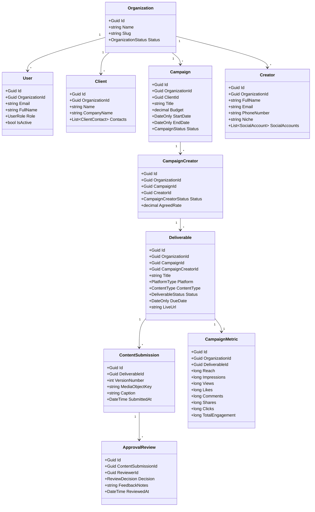

# Domain Model Specification — Campaign SaaS

## 1. Document Control
- **Title**: Domain Model & Ubiquitous Language Specification
- **Purpose**: Mendefinisikan agregat, entitas, value object, dan domain events untuk setiap modul.
- **Status**: ACCEPTED
- **Scope**: Core Domain Architecture

---

## 2. Core Aggregates per Module

---

## 3. Domain Enums & Value Objects

### 3.1 Enums
- **`OrganizationStatus`**: `Active`, `Suspended`, `Trial`
- **`UserRole`**: `AgencyOwner`, `CampaignManager`, `ContentReviewer`, `Creator`
- **`CampaignStatus`**: `Draft`, `Planned`, `Active`, `Paused`, `Completed`, `Cancelled`
- **`CampaignCreatorStatus`**: `Shortlisted`, `Invited`, `Accepted`, `Rejected`, `Negotiation`, `Confirmed`, `Completed`
- **`DeliverableStatus`**: `Pending`, `Submitted`, `Revision`, `Approved`, `Published`, `Rejected`
- **`ReviewDecision`**: `Approved`, `RevisionRequested`, `Rejected`
- **`PlatformType`**: `Instagram`, `TikTok`, `YouTube`, `TwitterX`, `Other`
- **`ContentType`**: `Reel`, `Story`, `FeedPost`, `Shorts`, `DedicatedVideo`, `IntegratedVideo`

### 3.2 Value Objects
- **`SocialAccount`**: `PlatformType Platform`, `string Handle`, `string ProfileUrl`, `long FollowerCount`
- **`Money`**: `decimal Amount`, `string Currency (default: IDR)`
- **`ClientContact`**: `string Name`, `string Email`, `string PhoneNumber`, `string Position`

---

## 4. Domain Events
- **`CampaignCreatedEvent`**: Dipicu saat campaign baru dibuat.
- **`CampaignStatusChangedEvent`**: Dipicu saat status campaign berubah.
- **`CreatorInvitedEvent`**: Dipicu saat creator diundang ke roster campaign.
- **`DeliverableSubmittedEvent`**: Dipicu saat creator mengunggah submission konten baru.
- **`RevisionRequestedEvent`**: Dipicu saat reviewer meminta revisi materi konten.
- **`ContentApprovedEvent`**: Dipicu saat draft konten disetujui.
- **`ContentPublishedEvent`**: Dipicu saat link posting live diunggah.
- **`ReportGeneratedEvent`**: Dipicu saat file PDF laporan berhasil diproses jsreport.
