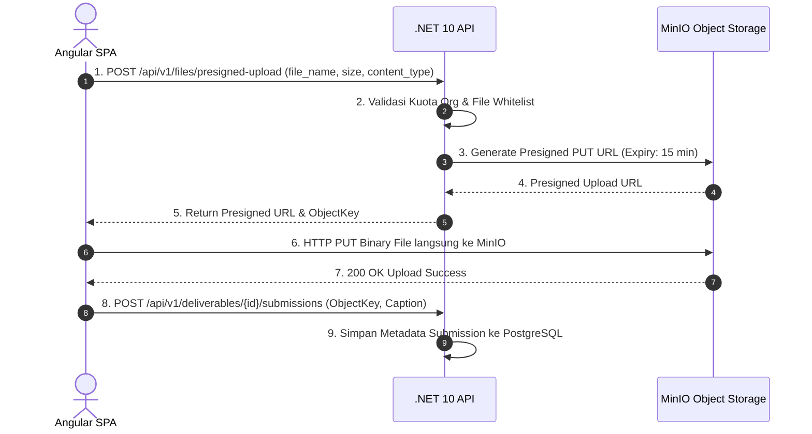

# File Storage Architecture (MinIO) — Campaign SaaS

## 1. Document Control
- **Title**: Object Storage & Asset Management
- **Purpose**: Arsitektur penyimpanan file binary media, dokumen brief, dan laporan PDF menggunakan MinIO.
- **Status**: ACCEPTED
- **Scope**: Object Storage Architecture

---

## 2. Logical Bucket Layout
MinIO dikonfigurasi dengan 5 bucket logis terisolasi:

```plaintext
minio-storage/
├── campaign-assets/       # Brief attachments, guideline PDF dari brand
├── creator-content/       # Video draft (.mp4, .mov), photo draft (.jpg, .png)
├── reports/               # Output PDF laporan yang dihasilkan jsreport
├── documents/             # Dokumen pendukung agensi
└── exports/               # File ekspor data CSV/Excel sementara
```

---

## 3. Object Key Naming Convention
Untuk menjamin isolasi multi-tenant dan mencegah penumpukan file:
```text
{bucket-name}/orgs/{organization_id}/campaigns/{campaign_id}/{deliverable_id}/v{version}/{file_uuid}_{filename}
```

---

## 4. Alur Presigned Upload & Download


