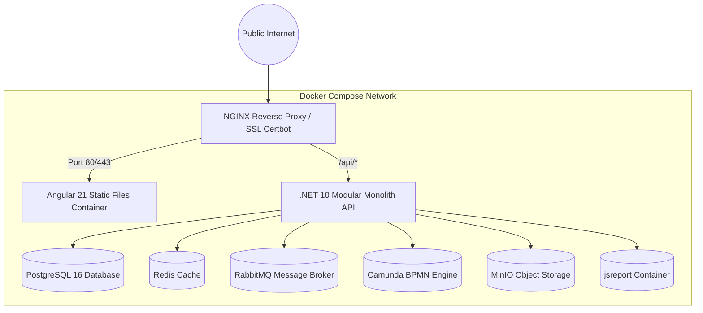

# Infrastructure & Deployment Topology — Campaign SaaS

## 1. Document Control
- **Title**: Infrastructure & Deployment Specification
- **Purpose**: Spesifikasi server VPS, Docker Compose topology, alokasi container, backup, dan monitoring untuk deployment MVP.
- **Status**: ACCEPTED
- **Scope**: Single-Node Linux VPS Deployment

---

## 2. VPS Sizing & Hardware Requirements (MVP Baseline)
- **Environment**: Ubuntu Server 24.04 LTS
- **CPU**: 4 vCPU
- **RAM**: 16 GB RAM (Dukungan penuh untuk .NET 10, JVM Camunda, PostgreSQL, Redis, MinIO, jsreport)
- **Disk**: 160 GB NVMe SSD (Penyimpanan database & cache MinIO lokal)
- **Bandwidth**: 1 Gbps Unmetered

---

## 3. Docker Compose Topology

---

## 4. Container Allocation & Resource Limits

| Service Container | Image Base | Memory Limit | Port Internal | Keterangan |
| :--- | :--- | :--- | :--- | :--- |
| `api` | `mcr.microsoft.com/dotnet/aspnet:10.0` | 2 GB | 5000 | Core Modular Monolith API |
| `client` | `nginx:alpine` | 256 MB | 80 | Angular 21 Standalone SPA |
| `postgres` | `postgres:16-alpine` | 3 GB | 5432 | Primary Source of Truth |
| `redis` | `redis:7-alpine` | 1 GB | 6379 | Cache & Rate Limiting |
| `rabbitmq` | `rabbitmq:3-management-alpine` | 1 GB | 5672, 15672 | Message Broker |
| `camunda` | `camunda/camunda-bpm-platform:run-latest` | 2 GB | 8080 | Workflow Orchestration |
| `minio` | `minio/minio:latest` | 2 GB | 9000, 9001 | Object Storage |
| `jsreport` | `jsreport/jsreport:latest` | 2 GB | 5488 | PDF Report Generator |

---

## 5. Backup & Disaster Recovery
- **PostgreSQL**: Automated Daily `pg_dump` terenkripsi yang diunggah ke secondary remote backup storage.
- **MinIO**: Volume data dipasang pada persistent mount path `/var/data/minio`.
